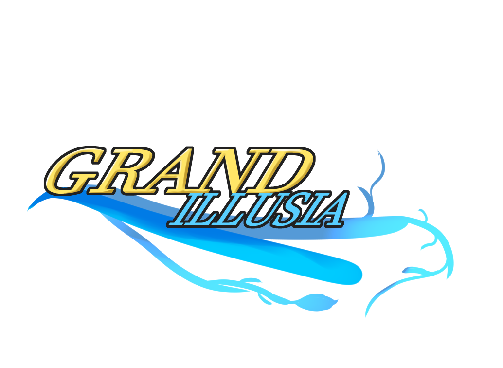

This is a [Next.js](https://nextjs.org/) project bootstrapped with [`create-next-app`](https://github.com/vercel/next.js/tree/canary/packages/create-next-app).

## Getting Started
=======

Grand Illusia is a browser-based strategy-RPG for PC, a project currently being made with Next.js in Phaser.

## Compiling and Hosting

In order to deploy the game, run `npm run dev` or `npm run build` from the main directory.
The scorboard system uses a sqlite3 database, so be certain to run `schema.sql` in the core directory before launching the website if you want to have scores be saved! 

Below is a design document containing information about the original scope of the game. Not all of these features are implemented, but they remain as 
a point of reference should development be continued on this project.

------
# Design Document
## Getting Started
Players will be able to create accounts to log in and save their progress in the game, as well as the growth of their Units for future play.
Afterwards, hit the 'play' button on the front page to get started!

## The Game

The plan for this game is to be a turn-based, grid-based small tactical RPG with - potentially - slight multiplayer features in the future.
You will be able to choose one primary hero character of three at the very beginning of the game, and throughout the game, through special events
as well as regular battles with opponents, you will be able to recruit additional characters to help you in each level, up to 5 in total at any
given time.

## Combat Flow

The player's and the AI opponent take turns performing actions with all of their units in succession. Each side recieves a number of Action Points,
through which they can choose to have a given unit take actions. The goal is to defeat all opposing units, or otherwise complete an objective
noted ahead of time.

### Units
Units, the characters you play as, are your your means of completion throughout the game. Units have varying statistics, effects, and skills which
can be used in synergy to empower your group.

| Base Stats | Description |
| ---- | ---- |
| HP (Hit Points) | A unit's hit points represents the amount of damage it can take before it is defeated. Hit points can be recovered, but once a unit's hit points hit 0, it is defeated and can't be healed short of very powerful skills, or until after a level ends.|
| MP (Magic Points) | A resource each unit consumes to use non-basic Skills. This may regenerate automatically per round, or may have to be restored by using certain other actions. |
| Skills | Additional abilities a unit has access to. These include more powerful attacks, magic, supportive effects, or even passive abilities. Skills can increase in power with use.|
| AP (Action Points) | Used per unit to act in combat. More is described below. | 

| Boosting Stats | Description |
| ---- | ---- |
| Attack | A unit's physical attack power. Most non-magical attacks, including Skill attacks, will increase in power with this stat. |
| Defense | A unit's protection or defensive ability. It causes incoming attacks that are boosted by Attack to deal less damage. |
| Force | A unit's magical ability. This increases the power of magical effects and Skill attacks. |
| Spirit | A unit's resistane to magic. It causing incoming attacks that are boosted by Force to deal less damage. |
| Hit | A unit's precision. It increases a unit's attacks' likelihood of hitting the target against their Speed. Notably, magical Skill attacks' accuracy scale with Force, not Hit. |
| Speed | A unit's dexterity. This determines a unit's likelihood to dodge attacks. |

### Action Points

Each side in a combat recieves a number of action points based on the units posessed and active. Certain units may have effects that increase or
reduce the amount of action points they grant their side, but generally each unit grants 1 point. Once a unit has acted, it cannot act again until
every other allied unit that can act has done so at least once. After this point, any remaining action points can be spent in the same way. This
allows for the possibility of a unit acting more than once in one turn.

## Outside of Combat

The game follows a somewhat linear story based on the starting character your choose, adventuring through a series of levels for each major area
in the game. You may change your party of units you want to use in each level, change skills you'd like to bring, and Advance units who meet
the prerequisites to do so. After completing levels, there may be a chance that you can recruit one of the opposing units.

### Advance

A unit that meets certain requirements (Level, levels of skills, certain stats reaching a certain height) may qualify to Advance. This is
essentially your average 'job change' feature. A unit that Advances' appearance might change, as well as its stat distrobution. It also allows
units to unlock more, more powerful Skills.
